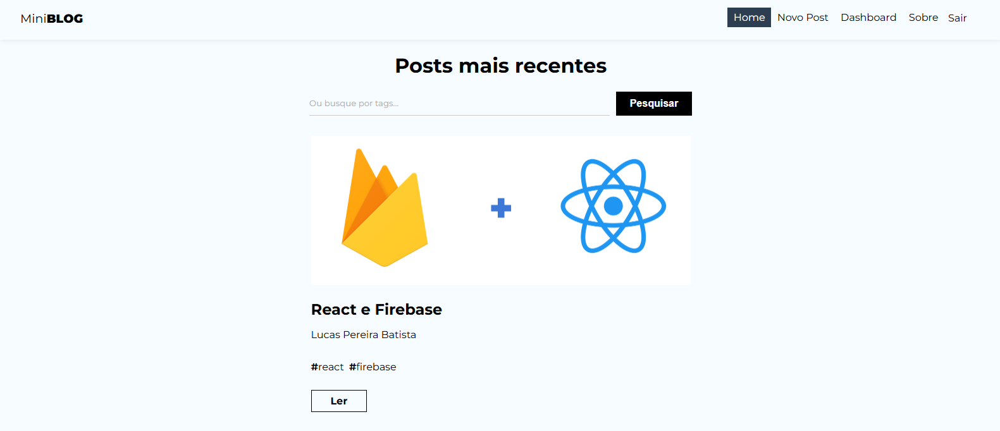

---

## :sparkles: Recursos

- ****Cadastro e Login**** de usuários (Firebase Authentication).
- ****Criação, Edição e Exclusão**** de postagens (Firestore).
- ****Listagem e Visualização**** de postagens.
- ****Filtro/Pesquisa**** por título.
- ****Feedback ao usuário**** (alertas, mensagens de sucesso ou erro).

---

## :wrench: Tecnologias Utilizadas

- **React** (Vite)
- **Firebase**
  - Authentication
  - Firestore
- **JavaScript**

---

## :inbox_tray: Instalação e Execução

Siga os passos abaixo para rodar o projeto localmente:

1. **Clone o repositório**:
   ```bash
   git clone https://github.com/LucasBatista37/Miniblog.git
   ```

2. **Instale as dependências**:
   ```bash
   npm install
   ```

3. **Configure as variáveis de ambiente**:
   - Crie um arquivo chamado `.env` na raiz do projeto (mesmo nível de `package.json`).
   - Copie o conteúdo de `.env.example` e preencha com as chaves do Firebase.
   Exemplo:
   ```bash
   VITE_API_KEY=...
   VITE_AUTH_DOMAIN=...
   VITE_PROJECT_ID=...
   VITE_STORAGE_BUCKET=...
   VITE_MESSAGING_SENDER_ID=...
   VITE_APP_ID=...
   VITE_MEASUREMENT_ID=...
   ```


4. **Inicie o servidor de desenvolvimento**:
   ```bash
   npm run dev
   ```

5. **Acesse no navegador**:
   ```text
   http://localhost:5173
   ```


---

## :sparkles: Como Usar

1. ****Crie uma conta**** no próprio sistema (ou faça login se já tiver uma).
2. ****Navegue até a página de criação de postagem**** e insira título e conteúdo (e demais campos, se houver).
3. ****Gerencie suas postagens**** na página de listagem, onde você pode editar ou excluir.
4. ****Explore**** as postagens de outros usuários.

---

## :lock: Protegendo Credenciais

- As chaves do Firebase são armazenadas em variáveis de ambiente (`.env`) para que não sejam expostas no repositório público.
- Verifique se `.env` está listado em `.gitignore`.

---

## :wave: Contato

Em caso de dúvidas ou sugestões:
- E-mail: [lucas.batista9734@gmail.com](mailto:-lucas.batista9734@gmail.com)
- LinkedIn: https://www.linkedin.com/in/lucas-batista-004212263
